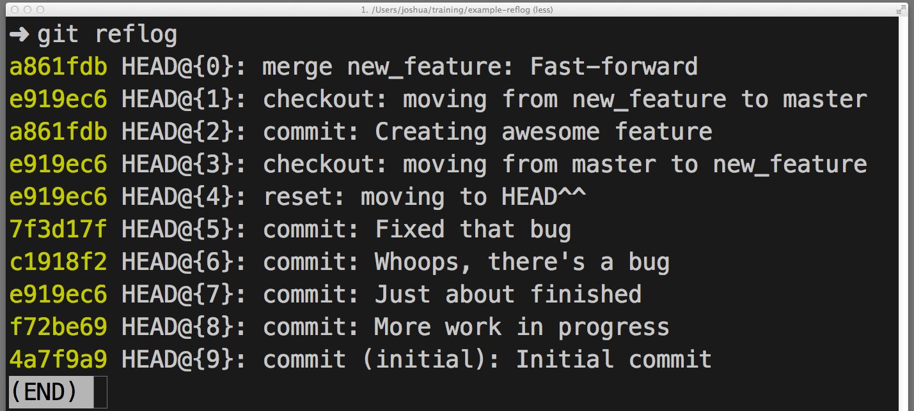
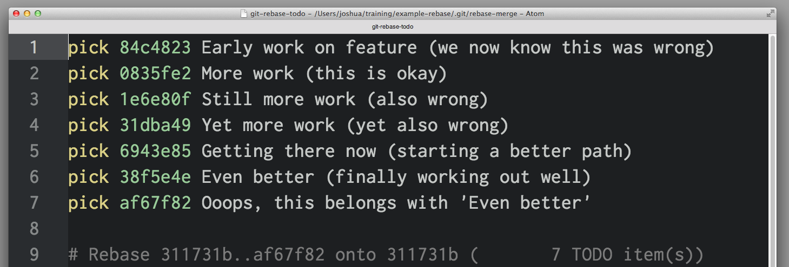
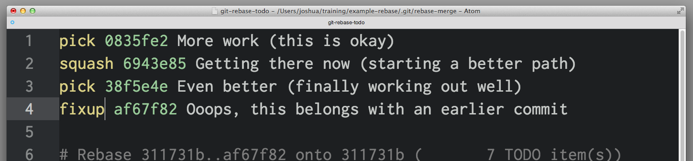
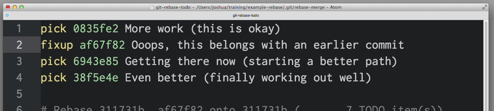
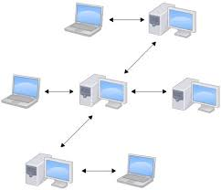

# 怎样撤销几乎所有的Git版本管理的操作

Ref: [How to undo (almost) anything with Git](https://blog.github.com/2015-06-08-how-to-undo-almost-anything-with-git/)

---

版本控制工具最具有特色的功能之一就是有能力可以"撤销"你做的更改(错误的更改). 在Git中, 各种"撤销"操作可能有些许不同.

当你做出了新的提交(Commit), Git存储你的仓库的快照[拓展阅读有关Git存储技术](https://stackoverflow.com/questions/8198105/how-does-git-store-files)在特定的时候(PS:例如commit时). 随后,你可以通过Git回到项目(仓库)的早期版本.

本文中, 我将通过一些你可能会遇见的常见的工作场景(你想通过撤销你所做出的更改),介绍你最应该采用的方法, 通过Git实现.(PS:英语的各种从句的表达习惯, 导致中文会用比较长的句子表达,我尽量在通顺的前提下, 仿照原文表达).

- 撤销一个已经公开(Push)的更改

**场景**: 你刚运行了```git push```, 将你的更改提交到GitHub, 现在,你意识到这些更改中有错误, 在其中某一次的commit上. 你想撤销那一次commit(一次push, 可以有很多commit).

**撤销操作**: ```git revert <SHA>``` (每一次commit生成的安全哈希值)

**命令解释**: ```git revert```将会创建一个新的, 与给定的<SHA>值所对应的 commit 相反的commit. 如果旧的commit 是"master"(比喻), 那新的commit就是"anti-master"(后面这有一段,容易混淆,其实就是说老的commit的任何修改都将复原, 个人理解. 原文: anything removed in the old commit will be added in the new commit and anything added in the old commit will be removed in the new commit.)

这是Git最安全, 最基础的撤销操作了, 因为它不改变操作历史(history, commit历史)--因此你可以```git push```这个新的反转commit 去改正你的错误.

- 修改最后一次的提交描述

**场景**: 你最后一次的提交描述有个拼写错误, ```git commit -m "Fxies bug #42"```, 但在**push之前**, 你意识到你应该写```Fixes bug #42```.

**撤销操作**: ```git commit -amend``` or ```git commit -amend -m "Fixes bug #42"```

**命令解释**: ```git commit --amend```将会更新,替换掉最近一次的commit, 用这次提交(这次提交可能包含了之前commit未包含的更改). 如果2次commit之间没有更改, 那就仅仅只是替换了commit 的message.

- 撤销"本地"所做的修改(Undo "local" changes)

**场景**: 一只猫走过你的键盘, 有些误更改被保存, 然后编辑器崩了. 你并**没有commit**这些更改, 然后,你想撤销(undo) 这个文件所做的全部更改(回到上次提交时的那样).

**撤销操作**: ```git checkout -- <bad filename>```

**命令解释**: ```git checkout``` 修改工作目录(work directory)下的文件到Git所记录的上一个状态(版本库中所存的).你可以提供一个branch name or specific SHA你想要回去的,或者使用默认, 默认的Git会checkout HEAD(最后一次commit在目前所执行checkout的分支)  
注意:任何你撤销的更改都要消失, 这些更改没有被commit, Git不能再找回.确保你知道你要丢弃的是哪些更改(可以使用```git diff```来确认).

- 重置"本地"所做的修改(Reset "local" changes)

**场景**: 做出了一些commit, 并使用了```git reset --hard``` 撤销这些commit, 但这时你想把那些更改找回来.

**撤销操作**: ```git reset <last good SHA>``` 或者 ```git reset --hard <last good SHA>```

**命令解释**: ```git reset <SHA>/HEAD```使你的仓库(repository)历史回到某个具体的SHA所代表的状态, 好像那些被撤销的commit从没有发生过. 默认的, ```git reset```保留工作目录(意思是不修改本地文件以soft方式回退,其它还有mixed 及hard,后面会专门拓展这部分内容).commit被撤销,但commit所代表的修改仍在硬盘中. 这是最安全的选项. 但更多时,希望硬盘一同恢复,这是--hard选项所代表的.

- 撤销所做出的对本地的撤销(Redo after undo "local")

**场景**: 你做了一些commits, 使用了```git reset --hard```去撤销一些commit(如上所见), 然后意识到,你并不想这么做.

**撤销操作**: ```git reflog``` 或```git reset``` 或 ```git checkout```

**命令解释**: ```git reflog``` 是一个很好的(资源)resource, 对于恢复项目历史. 你可以恢复几乎任何你做的提交(commit), 通过reflog.

你可能对```git log```比较熟, 这个命令显示你的commit的列表. ```git reflog```类似, 但显示的是HEAD更改的历史.(PS:如果你对一些基础的git概念不了理,可能你会很困惑,请直接看最后,我在后面加上了一些基础概念的内容,再返回来看, 相信你会很容易明白这里的意思!)

一些说明:
- HEAD changes only HEAD changes when you switch branches, make commits with git commit and un-make commits with git reset. but HEAD does not change when you git checkout -- <bad filename> (from an earlier scenario--as mentioned before, those changes were never committed, so the reflog can't help us recover those.) (对于HEAD的翻译,感觉怎么解释都不够准确,这一段保持原文, 这里列举了一些HAED会发生变化的情况,及不生的情况.总体上:你所做的修改要显示的告诉Git它会改变HEAD,对于commit的修改都属于, 但checkout 对文件的修改, 不add 并commit了Git 是不会改变HEAD的!)

1. ```git reflog```并不一直保存, Git会定期的清除不可访问的对象,不要期望想找到几个月前的提交在reflog中.

2. 你的reflog仅属于你自己, 你不能用git reflog存储别的开发者未push的commit.



那,如何通过reflog 去"redo" 先前的"undone" commit(s)?这取决于你想要实现什么效果:

3. 如果你想restore 项目历史, 使记录停留在那里, ```git reset --hard <SHA>```

4. 如果你想重建一个或更多的文件,在你的working directory,从版本库中,而不改变git历史, 使用```git checkout <SHA> --<filename>```

5. 如果你想重新使用之前的提交(replay exactly one of those commits into your repository. 感觉翻译的不合适, 可以将一个一个commit想像成一个舞台剧的一幕一幕, 每一幕都精确记录的当时的场景,人物发展, 过后你想重新回到那一幕,继续发展剧情), 使用```git cherry-pick <SHA>```.

- 再考虑结合上分支的情况

**场景**: 你做出了commit, 然后意识到你现在在master分支上, 你希望你刚做的commit 转移到feature分支.

**撤销操作**: ```git branch feature```, ```git reset --hard origin/master```, and ```git checkout feature```

**命令解释**: 你可能经常使用```git checkout -b <name>```去新建一个分支, 这是一个快捷方式,新建并切换到新分支上, 但如果你不想切换到新分支(在创建新分支时), ```git branch feature```创建一个新的名为feature分支(该分支是指向最新的提交的), 而将你留在master分支上.

然后, ```git reset --hard (origin/master)``` 将master回拨到origin/master,(晚于你的任何未push的commits), 对于这些commits, 不用担心,它们都在feature分支上.

最后, ```git checkout```再切换到新的feature 分支上(上有你全部,完整的近期工作).

- ?(Branch in time saves nine)

**场景**: 你之前开始新的分支feature, 是基于master的分支的. 但你的master 分支相当落后于origin/master. 现在你的master与origin/master同 步了, 你希望你在feature分支上的commits, 从现在开始(已经同步好的master), 而非之前很落后的那个.

**Undo with (原文如此, 放这里再用撤销操作不太恰当)**: ```git checkout feature``` and ```git rebase master```

**命令解释**: 你可能已经通过这些命令做到了: ```git reset```(no --hard, 有意的保更改在硬盘上)然后```git checkout -b <new branch name>```, 然后再commit这些更改, 但这样的话,你的提交历史就没了. 这有一个更好的方法.

```git rebase master``` 做了以下几件事:

1. 首先, 定位你目前所在分支(刚checkout 到的feature分支) 和 master分支共同的"祖先"(ancestor).

2. 然后, 它reset the currently-checked-out branch to that ancestor, holding all later commits in a temporary area.(这是说, 将feature分支上的东西(commit),先保存在缓存区, 然后将feature 重置为最初是master).

3. 然后, 将feature 所信赖的master 前进到最新的master, 再重新提交缓存的commit, 在新的master的最后(PS:后面的补充图,会有图来说明,一看即明rebase/merge区别).

4. 大范围的 undo/redo

**场景**: 你开发一个新feature,沿某个方向, 干了一半,你想到了其它更好的解决方案, 你已经做了很多commit, 但你仅想要其中一半, 你可能仅仅想要另一些disappear.

**Undo with**: ```git rebase -i <earlier SHA>

**What's happening**: -i 标识使rebase 进入交互模式, 它在一开始(前2步)跟上面讨论的rebase一样, 但在重新提交commits(第3步)时, 它暂停并允许你轻微调整each commit, 在重新提交时.

```rebase -i ``` 将会打开你默认的text editor, with a list of commits being applied. like this:



前2列是健, 第一个是是否选中, 对第二个<SHA>所标识的commit. 默认的, ```rebase -i ```假设每一个commit 都被选中.

想抛弃这个commit, 仅仅删除这一行(在你的编辑器中).

如果你杨保存这些更改的内容,而重新编辑提交信息(commit messages), 可以使用reword(替换掉pick)或仅仅用r替换. 看起来直接修改提交信息很诱人, 但这并不会生效, ```rebase - i```全忽略掉SHA列之后的信息(这些信息显示在这,仅仅是帮助你想起这次提交是什么), 当你完成了这些.你会得到提示,在任何新的commit message 需要被重写时.

如果你想合并2个commit到一起,你可以使用, squash or fixup, 如下:



```squash``` and ```fixup``` 会将它这一行与"上面"一次合并提交(in this scenario, 0835fe2 and 6943e85 will be combined into one commit, then 38f5e4e and af67f82 will be combined together into another.).

当你选择squash, Git 将会提示我们,一个新的,合并的分支需要一个新的commit message; fixup 则会给予新的commit一个message 从第一个commit in the list.(举例说明: Here, you know that af67f82 is an “ooops” commit, so you’ll just use the commit message from 38f5e4e as is, but you’ll write a new message for the new commit you get from combining 0835fe2 and 6943e85.) 

当你保存并退出编辑器时, Git将应用你的commmits 以从上到下的顺序, 你可以更改commit的顺序, 如果你想的话(举例说明:you could have combined af67f82 with 0835fe2 by arranging things like this:)



- 更正较早前的提交

**场景**: 你没能将某个文件加在较早前的commit中, 如果可以的话,那更好. 你还尚未**没有push**, 但它对不是最近一次的commit, 所以你不能使用 commit --amend .

**Undo with**: ```git commit --squash <SHA of the earlier commit>``` and ```git rebase --autosquash -i <even earlier SHA>```

**What's happening**: 将会创建一个新的commit with a commit message 例如 squash Earlier commit.

你也能使用```git commit --fixup``` 如果你不想被提示写一个新的commit message for the combined commit. 在这种场景中, 你可以这样用,既然你想用早前的commit message during rebase.

```rebase --autosquash -i``` 将launch an interactive rebase editor, but the editor will open with any squash! and fixup! commits already paired to be commit target in the list of commits, like so(这段说,加了--autosquash标识的rebase已经会有些许squash or fixup, commits 已经自动配好了对):


当使用 --squash or --fixup commit 时,你可能不会用具体的<SHA>, 你可能会使用Git's ^ and ~ 操作符. HEAD^ 是HEAD前一个提交. HEAD~4是4个commits before HEAD(总共5个揭)

- 停止跟踪已经跟踪文件(Stop tracking a tracked file)

**场景**: 你意外的将application.log 通过```git add```加到repository中, 现在你每运行一次application都有相应的日志生成, 都提示你有未保存的修改(unstaged changes in application.log), 你将*.log 加入到了.gitignore 中,但仍会提示--怎么才能撤销跟踪?

**Undo with**: ```git rm --cached application.log```

**What's happening**: .gitignore阻止Git跟踪被忽略的文件(此文件必须从未被加入repo中), 一旦已经被跟踪, Git将持续跟踪它的变动.

如果你想忽略这些被错误跟踪的文件, ```git rm --cached```将会删除对它的跟踪. 这时,它的改变,git status将不会看到.

这些就是怎么撤销几乎所有的更改, 上面用到的这些Git命令, 在下面的链接里你可以了解更多. 请在相关文档中查阅:

- [checkout](https://git-scm.com/docs/git-checkout)

- [commit](http://git-scm.com/docs/git-commit)

- [rebase](http://git-scm.com/docs/git-rebase)

- [reflog](http://git-scm.com/docs/git-reflog)

- [reset](http://git-scm.com/docs/git-reset)

- [revert](http://git-scm.com/docs/git-revert)

- [rm](http://git-scm.com/docs/git-rm)

# 额外补充图:  
1. [stackoverflow上有关soft, mixed(default), hard三种merge模式的区别的图](https://stackoverflow.com/questions/3528245/whats-the-difference-between-git-reset-mixed-soft-and-hard)


2. [git 基本概念的图](http://blog.csdn.net/xiantian7/article/details/19048913)


3. git distribution 辅助理解图



4. 同时我自己也总结了一份不太成体系的命令集, 也一并贴出.  
[git 常用命令集合](https://github.com/kakuchange/technicalTranslation/blob/master/other/git_command.md)

# About Translater

github: https://github.com/kakukosaku

E-mail: scugjs@gmail.com.

If you found any mistake(this article) or you have any question, contact me or open issue. 🙃
